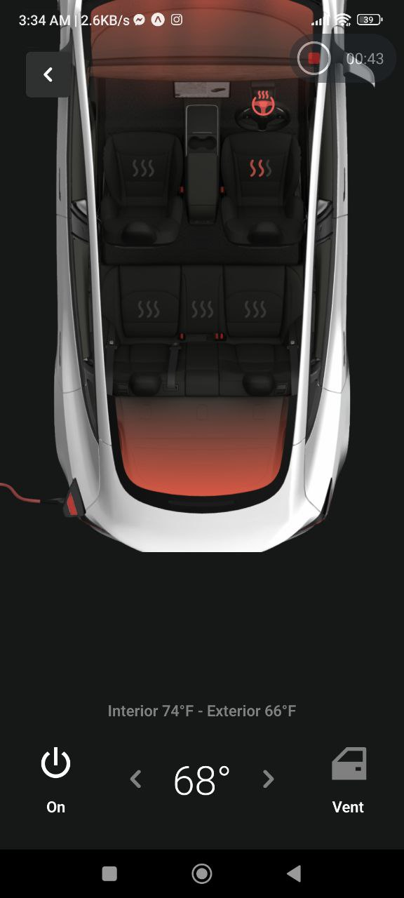
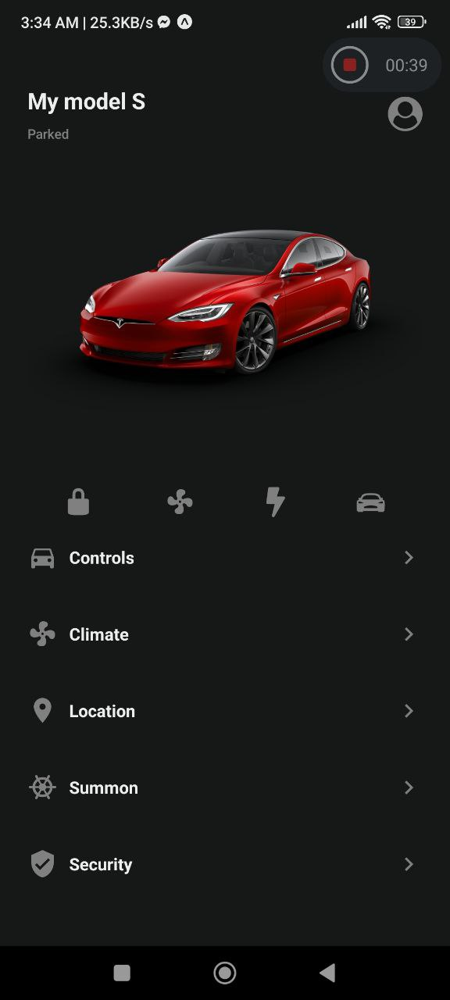

# Android -- Tesla Mobile Application
## Welcome! 👋

Thanks for checking out this Application.

## Overview
A simple application for checking on Tesla Cars using Android mobile with simple and great UI.

### Links

- App URL: [Github](https://github.com/shaheen7a/Android--Tesla-app.git)
- App Download URL: [Dropbox](https://www.dropbox.com/s/a9aw626vyb9ai6f/Tesla%20Manager.apk?dl=0)

## My process

### Built with

- React Native
- Expo Routers
- React Native Fonts
- Custom Hook (useFetch)
- CSS
- JavaScript
- JSX

## Author

- Linkedin - [@aous-shaheen-381636221](https://www.linkedin.com/in/shaheen2001/)
- Facebook - [@aoushaheen7](https://www.facebook.com/shaheen72001/)

By me 🚀🚀🚀

## 📝 Notes

- [Expo Router: Docs](https://expo.github.io/router)
- [Expo Router: Repo](https://github.com/expo/router)
- [Request for Comments](https://github.com/expo/router/discussions/1)

